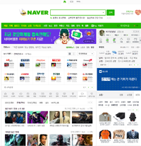
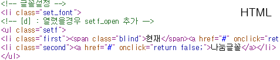
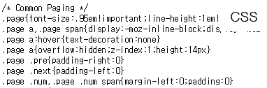

#HTML이란 ?

HTML이란 무엇일까요? ?

Hyper Text Markup Language 의 줄임말로써 하이퍼텍스트를 작성하기 위해 개발된 언어입니다.

HTML은 문서의 글자,그래픽,하이퍼링크,그림 등 웹 브라우저에 페이지를 표현하는 역할을 
합니다. HTML , CSS 사용하여 아래 이미지 처럼 구현할 수 있습니다.

ex) 네이버
 

위에 보이는 이미지는 우리가 잘 알고있는 네이버라는 사이트죠,

웹 디자이너가 PSD 파일로 디자인을 건네주면  

ex) **HTML** 소스  

ex) **CSS** 소스  
 

**HTML,CSS**를 이용하여 웹브라우저에 표현할 수 있어요.  
그런데 의문이 드는 것이 있을거에요 저렇게 **HTML , CSS** 로 작성하지 않고 디자이너가 전달해준 PSD(이미지) 자체를 웹 브라우저에 올리면 저렇게 번거롭게 작업하지않고 디자인 그대로 화면이 출력될 거라고 생각이 들 수 도 있어요.

---

 만약에 그림만 보여주는 
화면이라면 그렇게 작업을 하셔도 되지만, 우리가 사용하는 홈페이지들은 대부분 사용자가 직접 사용을 하며 체험을 하죠? (검색창에 검색하기, 로그인하기, 내정보 들어가기)
그런데 통으로된 이미지를 올리면 Back-End 웹 개발자가 사용자가 사용해야 하는 기능 작업을 진행하지 못합니다.

---

우리가 배우는 Front-End 과정은 Html , Css , JavaScript를 이용하여 사용자가 쉽고 간편하게 웹을 사용할 수 있게 웹표준과 누구나 동등한 웹 환경을 사용할 수 있게 웹 접근성 과정을 진행 될 것입니다.

----

저의 Front-End 강의는 실무에서 가장 많이 접하고 많이 사용하는 것 위주로 하고있습니다. 그래서 단기간에 학습이 되도록 진행되고 있습니다. 강의에서는 필요한것 위주로 작업을 진행하도록 하고 더 알면 좋은것 들은 따로 설명은 없이 어떤것이 있는정도만 알려드리도록 할게요. 

저는 여러분이 간단하고 흥미 있게 공부할 수 있는 정도의 방향을 제시를 하니 여러분들은 강좌에서 설명하고 있는 것 이외에 디테일하게 공부하시는 것을 추천합니다!

그럼 이쯤에서 간단한 HTML의 설명을 마치고, 이제 부터 강의 시작 하겠습니다!