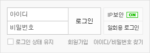
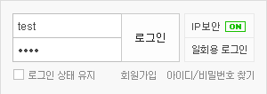
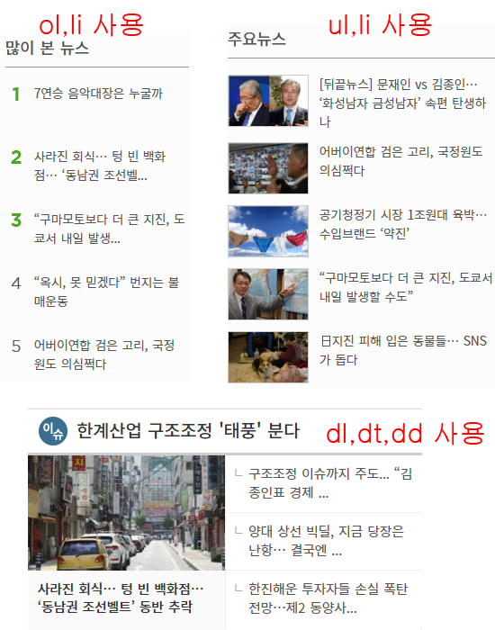
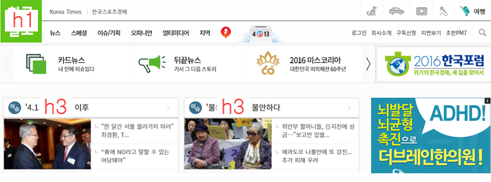

###### 여기서 잠깐!
###### 모든 예제는  jsfiddle 로 구성 되었습니다.
###### 직접 강좌를 들으시고 자신만의 방식대로 소스를 직접 수정해보고 추가해보는 열정적인 당신이 되어주세요! 아래에 jsfiddle 간단한 사용 방법을 알려 드리겠습니다.

[jsfiddle 바로가기](https://jsfiddle.net) 을 접속해보면 아래 이미지로 접속이 되실거에요


HTML 이라고 써있는 부분에 HTML 태그를 입력하고 CSS도 입혀보실것이 있다면 넣으시고 마찬가지로 javascript 도 가능하답니다.

상단 메뉴에서 Run 을 누르면 아래 이미지처럼  Result 부분에 작성하신 결과물을 확인해 보실수 있어요.


강좌는 jsfiddle로 연동되게 예제를 보여드릴 예정이오니 직접 이것저것 만져보면서 강좌를 들으시면 빠른 성장을 하실것이라 생각되어요. 

---

#필수 Tag 15선

[*1*] **a**   

a 태그는 인라인 태그로서 텍스트나 이미지에 링크를 연결해 줄때 필요해요!

기본속성은 href , target 으로 구성됩니다.

``` html
<a href="http://www.naver.com" target="_blank">네이버 Go! Go!</a>
```

target="_blank" 속성을 넣어주면 링크를 눌렀을 경우 링크가 새창으로 이동되요.

``` html
<a href="http://www.naver.com" target="_self">네이버 Go! Go!</a>
```

``` html
<a href="http://www.naver.com">네이버 Go! Go!</a>
```

target="_self" 속성은 현재페이지에서 링크로 이동되요. 하지만 _self 속성은 기본속성이니 적지 않으셔도 됩니다.

[예제 확인하기](https://jsfiddle.net/leetaesu/ynpa6jgj/1/)

######그외에도 2개의 부분이 더있는데 이부분은 특별한 경우말고는 사용되지 않아요. 그래도 호기심 가득한 분이시라면 테스트 해보시는 것 을 추천합니다.
######_parent : 부모창에 해당 링크를 열어요
######_top : 화면이 여러 프레임으로 이루어져있는 경우 모든 프레임을 지우고 전체 화면에 열어요

---

[*2*] **br**   

br 태그는 영역을 줄바꿈 하는 역할을 담당합니다.

br 태그는 단일 태그이기 때문에 <br /> 슬러시로 마무리를 지어줍니다.
```ex)삼치와 마요는 투닥투닥 대지만, 아플때는 서로를 아끼는 귀여운 고양이들이랍니다.``` 흔히 이런 텍스트가 있는경우 강제 개행이 필요할 때가 있겠죠? 이럴때는 
```ex)삼치와 마요는 투닥투닥 대지만,<br /> 아플때는 서로를 아끼는 귀여운 고양이들이랍니다.``` 해주면 투닥투닥 대지만, 에서 강제개행이 이루어 집니다. 텍스트뿐만 아니라 ```<br /><br /><br />``` 이런식으로 여러번을 작성햇을 경우 한줄 개행이아니라 3줄 개행이라 단락의 공간이 생깁니다. 여백을 주고 싶을때는 나중에 배울 css속성의 padding , margin 속성을 이용하도록 해요

[예제 확인하기](https://jsfiddle.net/leetaesu/ynpa6jgj/2/)

---

[*3*] **link**

우리는 html과 css와 javascript로 작업을 진행하죠 그럼 html 파일에다가 css와 js를 적으면 index.html 파일의 크기가 너무많아지고 관리하기도 힘들어 지겠죠? 그런경우에는 css와 js 파일만을 작성할 파일을 작성한후 link 태그를 이용하도록 하죠

```html
 <link rel="stylesheet" href="test.css" />
 <script type="text/javascript" src="test.js"></script>
```

위에 보듯이 type 과 src 경로를 맞추어 주어서 link태그로 파일을 관리해 봅시다.

---

[*4*] **input**

input 태그는 폼안에 기본적인 컨트롤을 생성하죠, 
input 태그안에 여러가지 속성을 제어할 수 있는데,
type,name,value,size,width,height,max,maxlength,min 속성을 제어할 수 있습니다.

**type** 속성은 필수 속성으로써

* text : 텍스트 입력을 받기위한 필드로써 그대로 출력된다.
* password : 비밀번호를 받기위한 필드로써 ●●● 식으로 출력된다.
* checkbox : 복수 선택이 가능한 체크박스 생성 
* radio : 체크박스와는 달리 단일 선택만 가능한 박스 생성  
* submit : 송신버튼 생성  
* reset : 리셋버튼 생성  
* button : 범용버튼 생성.  
* image : 이미지버튼 생성.  
* file : 송신파일 선택필드 생성  
* hidden : 필드를 html상에는 있지만 눈으로는 보여지지 않는다.

**name** 속성   
name="이름"(필수 속성) : 컨트롤의 이름 지정. type의 속성이 checkbox나 radio일 경우 name속성이 같은 값으로 지정되면 하나의 그룹으로 취급한다.

**value** 속성  
value="값" : 초기값을 미리 정할 수 있다.

**size** 속성   
size="폭" : 컨트롤의 폭을 지정. type속성이 text이거나 password일 경우 문자수를 지정하고 그외의 경우에는 가로폭의 픽셀값을 지정한다.

**width , height** 속성  
요소의 가로와 세로 사이즈를 조정할 수 있지만, css로 처리하기 때문에 자주 사용되지 않는다.

**max , min** 속성 
max , min는 input 요소에 허용하는 값의 최소 최대값을 지정하지만 자주 사용되지 않는다. 
max,  : input요소에 허용하는 값의 최대값을 지정하지만 마찬가지로 사용되지 않는다.

**maxlength** 속성  
maxlength : type속성이 text이거나 password 일때 최대 글자수를 제한할 수 있게 해준다.

###### 아래 이미지를 보시면 자주보이는 naver의 로그인 하는 창입니다. 



###### 아이디라고 표시된 곳이 type 속성이 text로 표시되어있는 상태이고 비밀번호라고 되있는곳은 type속성이 password 라고 기재가 되어있습니다. 이부분에 아이디와 비밀번호를 입력하게되면 아래 이미지처럼 적용됩니다.

  

예제에서는 input의 기본적인 예제를 담아 보았습니다.

[예제 확인하기](https://jsfiddle.net/leetaesu/ynpa6jgj/3/)

---

[*5*] **textarea**

textarea는 사용자의 내용을 입력받을 수 있는 필드에요. 댓글입력,문의내용 같은 곳에서 볼 수 있죠, textarea는 input과 마찬가지로 많은 속성들을 가지고 있어요.

속성의 종류에는 

* autofocus : 페이지가 새로고침이 되면 포커스가 자동으로 가게 해줍니다.
* cols,rows : 표시될 폭을 문자수로 지정하는데 css 처리하는것이 좋습니다.
* disabled : 모든 조작을 불가능 하게 합니다.
* dirname : 요소의 방향성을 결정합니다.
* form : 다른 폼 소유자와 명시적으로 연관시키기위해 사용됩니다.
* maxlengh : type속성이 text이거나 password일 경우 최대 입력 문자수를 지정할수 있습니다.
* name : textarea의 이름을 지정합니다
* placeholder : 임의적으로 힌트를 보여줍니다. IE8 브라우저 이상만 지원합니다.
* readonly : 컨트롤의 조작을 불가능하게 하지만 데이터는 서버에 전송한다. true ,false 로 지정해줘요
* required : 필수요소인지를 지정합니다. true ,false 로 지정해줘요

textarea 의 간단한 예제를 아래에서 확인해보세요, 그리고 저속성들이 무엇을 뜻하는지 한번쯤 적어서 확인해보시면 좋을 듯 싶어요

[예제 확인하기](https://jsfiddle.net/leetaesu/ynpa6jgj/4/)

---

[*6*] **button**

버튼 요소를 생성합니다. textarea처럼 속성은 autofocus,disabled, name, type, value 5가지가 있어요.  
**type** 속성에서는  

* submit : 폼을 제출합니다. 기본값입니다.
* reset : 폼을 리셋합니다.
* button : 아무것도 하지 않습니다.

[예제 확인하기](https://jsfiddle.net/leetaesu/ynpa6jgj/5/)

---

[*7*] **table**

table 태그는 데이터가 담겨진 표 로써 생각하면 편해요, 예전에는 레이아웃을 짤때 table 을 사용하여 과도한 테이블 사용으로 인해 유지보수 및 소스가 상당히 지저분 했어요. 이제 웹표준으로 넘어오면서 table은 데이터를 담고있는 표라고 생각하면 될듯 해요.  

table은 머리,몸통,다리 라고 분류가 되있어서, thead,tbody,tfoot 으로써 table 의 종류를 표현 할 수 있어요. tr은 테이블은 단락을 의미하며 단락마다 th와 td를 사용하여 th는 제목이나 강조해야할부분 td는 설명,내용 이라고 보면 쉬어요!

그리고 thead 위부분에 col 태그라고있는데 col 태그는 테이블의 가로간격을 지정할 수 있어요. 테이블이 4개라면 4개의 col 태그를 사용하여 원하는 사이즈를 각자 조정할 수 있죠, col태그를 묶는 colgroup 이라는 같이 사용해줘야 깔끔한 소스가 된답니다.

그리고 caption이라고 테이블의 제목을 기재해줘야하는 태그가 있는데 이부분은 css속성으로 숨겨놓고 글만 적어서 표현만 해주게 작성해주면 되요.

```html
  <table cellpadding="0" cellspacing="0" border="3">
	<caption>고양이 설명 도표</caption>
	<colgroup>
		<col style="width:20%" /><col style="width:auto" />
	</colgroup>
	<thead>
		<tr>
			<th>회색고양이</th>
			<td>러시안블루</td>
		</tr>
	</thead>
	<tbody>
		<tr>
			<th>한국 길고양이</th>
			<td>코리안 숏헤어</td>
		</tr>
	</tbody>
	<tfoot>
		<tr>
			<th>하얀색고양이</th>
			<td>터키쉬앙고라</td>
		</tr>
	</tfoot>
  </table>
```


[*8*] **ol,ul,dl**

ul,ol,dl 태그는 리스트 태그의 종류로써 3가지는 각각 다른 의미를 갖고 있는다.  

ol과 ul는 li의 하위 구성을 가지며 ol은 순서가 있는 리스트를 사용할 때 사용하도록하고, ul은 순서가 중요하지 않은 리스트를 사용할떄 사용하죠!

그럼 dl 용어 설명 그룹으로써 dt로 제목을 구분하며 dd로 내용을 구분해요.

아래 그림으로 dl 과 ul , ol 의 사용된 곳을 보여드리도록 할게요.

 

[예제 확인하기](https://jsfiddle.net/leetaesu/ynpa6jgj/14/)


[*9*] **div , p**

div 요소는 태그자체는 특별한 의미가 없어서 문서의 레이아웃을 사용할 때 사용 되곤 해요. 그래서 모든 html 페이지에는 div태그가 가장 많이 들어가 있습니다. 무분별한 div 요소를 사용하지 마시고, 해당 의미가있는 태그를 사용하다가 의미가없이 정말 레이아웃만 적용 해야하는 부분에만 div 요소를 사용하셔야 됩니다.

p태그 요소는 문단을 표시해요, 어렵게 생각하지 마시고 문단으로 구분된곳은 p태그로 묶어주시면 됩니당!

``` html
<div>
	<p>div태그는 레이아웃의 영역으로만 사용하시는 걸 권장해요</p>
	<p>p 요소는 문단이란 말처럼 문단별로 구분 지을 수 있어요.</p>
</div>
```

---

[*10*] **h1~h6**

h태그는 1번부터 6번까지 지정 할 수 있어요. 숫자는 등급을 나타내며 h1 이 가장 높은 등급이며 h6이 가장 낮은등급이죠. 예를들어 홈페이지를 만들때 로고부분은 h1이 되겟죠? 아래 콘텐츠 영역에서 기사영역처럼 한영역이 있는부분은 h3이 되겠죠

  

한문서의 h1 요소는 한개만 사용하도록 해요. 그래서 로고부분이 가장 적당하겠죠?

[예제 확인하기](https://jsfiddle.net/leetaesu/ynpa6jgj/6/)

---

[*11*] **iframe**

iframe요소는 문서내에 다른 문서를 들어갈 때 사용됩니다.

속성에는 

* src : 출력될 내용의 URL 주소
* name : iframe 의 이름
* width : 가로 사이즈
* height : 세로 사이즈
* marginwidth : 좌우 여백
* marginheight : 상하 여백
* scrolling : 스크롤바 생성여부 (yes,no,auto) 
* align : 정렬위치
* frameborder : 프레임 테두리 경계선

``` html
<iframe id="abc" name="iframe" src="abc.html" width="100%" height="400px" scrolling="auto" frameborder="0" marginwidth="0">
```

[예제 확인하기](https://jsfiddle.net/leetaesu/ynpa6jgj/13/)

---

[*12*] **img**

이미지 태그요소는 이미지를 화면에 출력해주는 요소에요. 5가지의 속성이있는데 

1. src속성은 불러올 이미지의 주소를 나타내요 
2. alt 태그는 이미지가 표시되지 않는 상황에 출력될 글씨를 표현해주거나 센스리더기같은 시각장애인이 이미지를 볼 수 없을때 내용을 짐작할 수 있도록 도와주는 용도로 사용 되기도 합니다.
3. usemap 은 아래 map속성이 있을때 사용되요
4. width 사이즈와 height 사이즈 속성도 있지만 css로 처리하는것이 더 좋습니다.
  
[예제 확인하기](https://jsfiddle.net/leetaesu/ynpa6jgj/7/)

[*13*] **map**

map 요소는 이미지에 링크를 걸때 사용하는데 하나를 걸때는 위에서 봤던 a링크를 사용하면 쉽게 링크를 적용시킬 수 있죠? 그런데 하나의 이미지에 여러개의 링크가 필요할때는 map을 사용하여 처리하면 간편하게 작업을 하실 수 있습니다.

map요소를 작성할 때는 

``` html

<map name="imgMap">
	<area shape="rect" coords="0,0,348,438" href="링크주소" target="_blank"  alt="해당 링크걸 이미지 설명">
	<area shape="circle" coords="364,0,712,438" href="링크주소" target="_blank"  alt="해당 링크걸 이미지 설명">
	<area shape="poly" coords="364,0,712,438" href="링크주소" target="_blank"  alt="해당 링크걸 이미지 설명">
</map>
```
위 부분을 보게되면 이미지부분에 usemap에 imgMap 이라는 이름과 map name 의 부분에 이름이 동일한 걸 볼 수 있어요. 이로써 저 이미지의 usemap의 속성은 아래 맵 이름과 동일하게 할 수 있게 처리된거에요.

area의 속성에는

1. shape : 영역의 형태를 지정하는데 rect 는 사각형이며 가장 많이 사용됩니다. circle는 원형이고, poly는 다각형인데 자주 사용 되지 않아요
2. href는 a링크와 동일하게 링크를 적어주시면 되요
3. alt는 대체텍스트로써 기존에 설명드린 부분과 동일합니다.
4. coords 는 제일 중요한 부분인데 영역의 좌표 위치를 지정하는거에요. 

** coords 좌표를 지정하는 방법은 나중에 photoshop 강의에서 설명 드릴게요 **

* shape속성값이 rect일때 : 왼쪽위의 XY좌표와 오른쪽아래 XY좌표
* shape속성값이 circle일때 : 중심의 XY좌표와 반경
* shape속성값이 poly일때 : 첫번째 각의 XY좌표, 두번째각의 XY좌표, 세번째각의 XY좌표

아래예제에서는 고양이 2마리를 클릭해보면 링크가 걸린걸 알 수 있어요.   
(맵이 잘 적용되었나 확인하려고 href에 javascript 를 적은거이니 href부분은 신경안쓰셔도 됩니다)

[예제 확인하기](https://jsfiddle.net/leetaesu/ynpa6jgj/12/)

---

[*14*] **select**

select 요소는 선택목록을 생성해줍니다. 선택요소이기 때문에 한개이상의 값이 들어가 있어야 하죠. 여기서 값은 option으로 처리해줍니다.

select 속성에는 autofocus,disabled,form,multiple,name,required,size 의 여러개의 속성이 있는데 따른 기존에 input 이나 textarea 에서 보셨던 속성들이죠? 한가지 다른것이 보이네요 multiple 이라는 속성이 있는데 multiple은 복수선택이 가능해 집니다. 

``` html
<select name="category">
	<optgroup label="고양이">
      <option value="cat1">코리안 숏헤어</option>
      <option value="cat2">아메리칸 숏헤어</option>
	</optgroup>
	<optgroup label="강아지">
      <option value="dog1">리트리버</option>
      <option value="dog2">시바견</option>
	</optgroup>
</select>
```

위 코드를 보면 option값을 묶어주는 그룹이 optgroup 라고 있죠? 이곳에 label 에 글자를 넣어두면 select 창에 클릭은 안되지만 묶여있는 그룹타이틀명 처럼 표현할 수 있어요. 

[예제 확인하기](https://jsfiddle.net/leetaesu/ynpa6jgj/9/)

---

[*15*] **strong - span**

strong 요소는 글자를 굵게보여주는 효과와 해당내용의 중요함을 나타내 줍니다. css에서 font-weight:bold; 로는 굵은 색깔만 보여주니까 해당 글자가 중요함이 있을때는 strong 태그를 사용 하면 좋습니다. 

span 태그는 strong 요소와 마찬가지로 인라인속성 요소입니다. strong 태그처럼 의미는 없지만 인라인 요소이기 때문에 사용되는 곳이 많습니다.

``` html
<strong> 중요한 글씨 인라인 요소 </strong>
<span> 의미는 갖지 않지만 자주 사용되는 인라인 요소</span>
```
