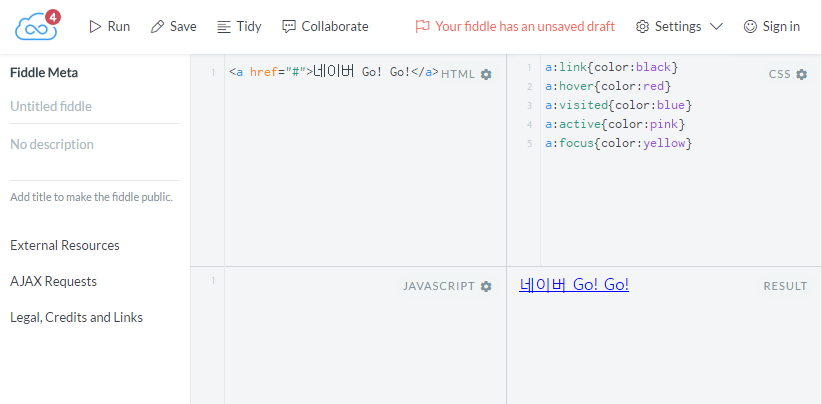

###### 여기서 잠깐!
###### 모든 예제는  jsfiddle 로 구성 되었습니다.
###### 직접 강좌를 들으시고 자신만의 방식대로 소스를 직접 수정해보고 추가해보는 열정적인 당신이 되어주세요! 아래에 jsfiddle 간단한 사용 방법을 알려 드리겠습니다.

[jsfiddle 바로가기](https://jsfiddle.net) 을 접속해보면 아래 이미지로 접속이 되실거에요


HTML 이라고 써있는 부분에 HTML 태그를 입력하고 CSS도 입혀보실것이 있다면 넣으시고 마찬가지로 javascript 도 가능하답니다.

상단 메뉴에서 Run 을 누르면 아래 이미지처럼  Result 부분에 작성하신 결과물을 확인해 보실수 있어요.



강좌는 jsfiddle로 연동되게 예제를 보여드릴 예정이오니 직접 이것저것 만져보면서 강좌를 들으시면 빠른 성장을 하실것이라 생각되어요. 

---

#필수 Tag 21선

[*1*] **a**   

a 태그는 인라인[^1] 태그로서 텍스트나 이미지에 링크를 연결해 줄때 필요해요!

기본속성은 href , target 으로 구성됩니다.

```<a href="http://www.naver.com" target="_blank">네이버 Go! Go!</a>```

target="_blank" 속성을 넣어주면 링크를 눌렀을 경우 링크가 새창으로 이동되요.

```<a href="http://www.naver.com" target="_self">네이버 Go! Go!</a>```

```<a href="http://www.naver.com">네이버 Go! Go!</a>```

target="_self" 속성은 현재페이지에서 링크로 이동되요. 하지만 _self 속성은 기본속성이니 적지 않으셔도 됩니다.

[예제 확인하기](https://jsfiddle.net/0hoesebk/4/)

########그외에도 2개의 부분이 더있는데 이부분은 특별한 경우말고는 사용되지 않아요. 그래도 호기심 가득한 분이시라면 테스트 해보시는 것 을 추천합니다.
########_parent : 부모창에 해당 링크를 열어요
########_top : 화면이 여러 프레임으로 이루어져있는 경우 모든 프레임을 지우고 전체 화면에 열어요

---

[*2*] **br**   

br 태그는 영역을 줄바꿈 하는 역할을 담당합니다.

br 태그는 단일 태그이기 때문에 <br /> 슬러시로 마무리를 지어줍니다.
```ex)삼치와 마요는 투닥투닥 대지만, 아플때는 서로를 아끼는 귀여운 고양이들이랍니다.``` 흔히 이런 텍스트가 있는경우 강제 개행이 필요할 때가 있겠죠? 이럴때는 
```ex)삼치와 마요는 투닥투닥 대지만,<br /> 아플때는 서로를 아끼는 귀여운 고양이들이랍니다.``` 해주면 투닥투닥 대지만, 에서 강제개행이 이루어 집니다. 텍스트뿐만 아니라 ```<br /><br /><br />``` 이런식으로 여러번을 작성햇을 경우 한줄 개행이아니라 3줄 개행이라 단락의 공간이 생깁니다. 여백을 주고 싶을때는 나중에 배울 css속성의 padding , margin 속성을 이용하도록 해요

[예제 확인하기](https://jsfiddle.net/juy1h5hr/1/)

3. input


4. textarea


5. button


6. table


7. ol,ul,dl


8. div


9. form


10. h1~h6


11. iframe


12. img 


13. map


14. link


15. select


16. strong - span


17. body - html


[^1]: 인라인속성은