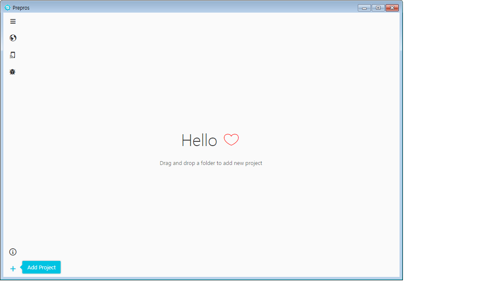
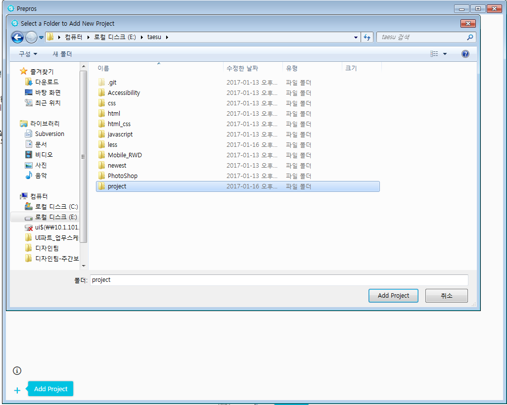
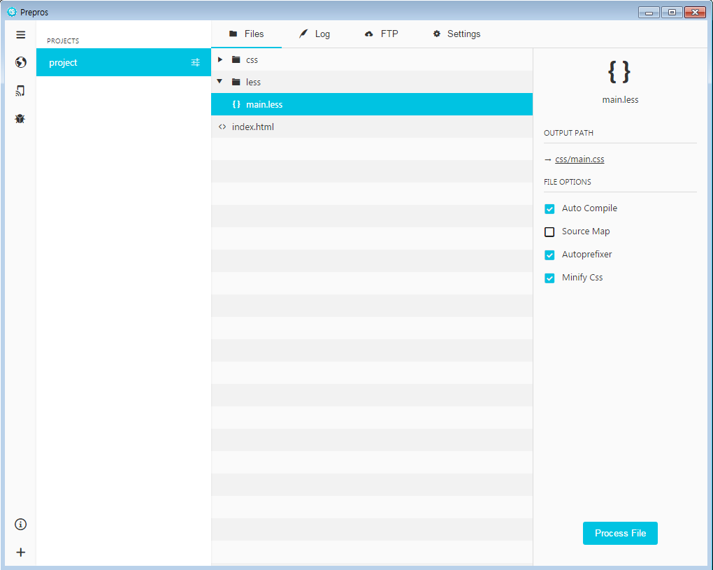
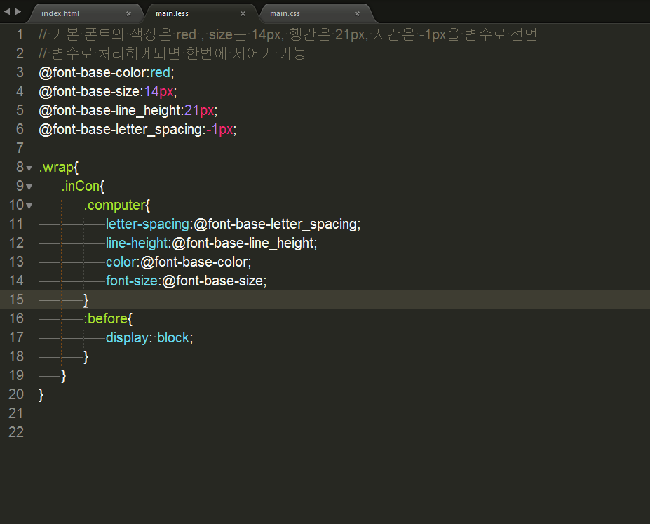
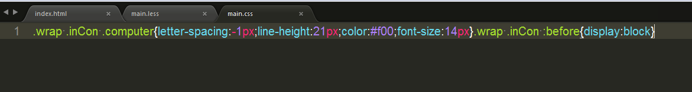
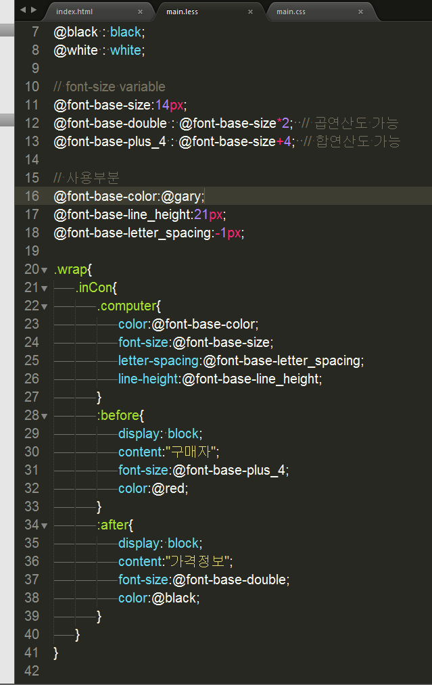
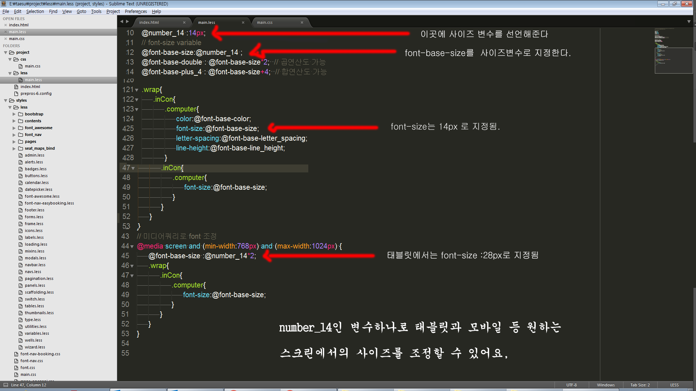

## less 파일 css 파일 컨버팅

less 파일을 브라우저에서 정상 작동하게 하려면 less관련 js 파일을 선언해주거나 프로그램으로 css로 전환 시키는 방법 2가지에요~ 더 있을 수 도 있겠지만, 의미없는 것이니 우선 넘어가겠어요!

js 파일선언으로 less를 사용하게 되면 리소스를 많이먹기 때문에 추천하고 있지 않으며, 기본적으로 라이브서버에 배포전 less를 css파일로 전환시키는 방법이 있죠. 하지만  local 환경에서 less를 써보기위해 작업하는거면 간단한 프로그램을 이용하여 사용할 수도 있어요.

프로그램은 simpleless도 있지만, 저는 prepros만 사용해봐서 이걸로 설명 드릴게요~ prepros는 컨버팅이 실시간으로 이루어져 있어서 작업할때 간편합니다. 더좋은 프로그램이나 자신에게 맞는 프로그램이 있으면 그걸 사용하시는걸 추천합니다!

1. prepros 를 설치한다.
2. 설치하면 맨처음 화면에서 + (add project) 를 한다.
   
3. 추가할 프로젝트를 설정한다.
   
4. 그러면 해당 less 파일을 클릭해보면 
   
이런 화면이 나오는데  우선 사용을 해보시면서 따른기능은 무엇인지 확인하시면 되고, output path 이부분은 less파일 변환후 생성되는 css파일을 저장할 곳을 지정 하는곳입니다. 이곳만 잘 지정해 주시면되요~ 그러면 이제 less파일을 저장해보면 자동변환이 될거에요

#####※ prepros-4.2.0.exe 버전을 설치 하는것은 추천합니다. 최신버전은 유료 구매 팝업차이 떠서 귀찮으신 분들 추천합니다.

---

#less 분기 전 (분류 필요)


css 프레임워크는 sass , less , stylus 가 있습니다.

기본적으로 사용하던 css 문법이랑 비슷한 sass 와 less 가 가장 많이 쓰이고 있습니다.

sass 나 less 나 한개의 문법만 배워도 두가지는 서로 비슷한 면이 많아서 쉽게 사용할 수 있습니다.

저희는 라이브에 배포할때 코드압축을 따로 하지 않는걸로 알고있는데, 그럼 로컬환경 작업 방식으로 진행 하겠습니다.

less를 less.js로 변환을 해주면 서버자원을 많이 소모하기 때문에 css변환해서 올리면 서버자원을 

줄일 수 있습니다.

왜 우선 css 보다 less 를 사용해야하는 점 아래 3가지가 가장 대표적이죠!

1. 변수 

2. 믹스인

3. 중첩

초보자는 우선 이 3가지만 중점적으로 공부를 한다음 적용을 해보면 엄청 좋으실 거에요

그외에 더욱 효과적으로 사용할수 있게 도와주는 네임스페이스 기법 , 믹스인 추가활용법 등등 있고,

javascript 처럼 연산자나 기본 색상관련함수 ,수학관련 함수등 기본제공 함수도 있지만, 이건 3가지를 공부한다음에 진행하면 될 것 같아요

우선 가장 쉽게 이해하기 쉬운 부분부터 보자면 **중첩 관련 규칙**이 있어요

이게 무엇이냐면 간단하게 말해서 우리는 css 점수라는걸 다들 알고 계시죠? ( 아래 설명 있어요 )

important 10000점 ,인라인 스타일 1000점 , id는 100점 , 클래스는 10점 , 태그는 1점 이죠 ,

그래서 우리는 css 작성할때 순서대로 표기를 하고 있죠? 예시를 보여드릴게요


#### 기존 css 방식

``` css
.wrap .content .inBox{border:1px solid red}  
.wrap .content .inBox .pen_group{width:20px; height:30px}  
.wrap .content .inBox .pen_group .red_pen{color:red}  
```
기존 css방식에서는 중첩의 개념을 다 선언해줌으로써 css 점수를 적용해서 코드자체가 보기도 불편할뿐더러 유지보수 측면에서 상당히 나쁜편이었죠...

하지만 아래 less 의 중첩 규칙을 사용하면 새로운 css 추가되도 관리하기가 쉽고 편리해져요

#### less 방식
```css
.wrap{
	.content{
		.inBox{
			border:1px solid red;
			.pen_group{
				width:20px;
				height:30px;
				.red_pen{
					color:red;
				}
				.green_pen{
					color:green;
				}
			}
		}
	}
}

```

녹색펜(green_pen)이 추가로 생겼는데, 난 이펜을 펜이 모여있는곳 (pen_group)에 넣고 싶으면 바로 class를 생성하여 넣으시면 됩니다!

응용을 하자면 선택자와 클래스를 동시에 사용할 수 있는 편리함도 있어요. 아래에 소스로 보여드릴게요


**ex) 
1)red_pen 과 green_pen을  float으로 처리해주세요.   
2)펜 앞에 타이틀 "PEN" 이라고 문구를 넣어주세요   
3)첫번째 inBox 와 마지막 inBox 에는 강조를 주세요.    
**


#### less 방식
```css
.wrap{
	.content{
		.inBox{
			border:1px solid red;
			:first{ 	// .inBox 첫번째 선택
				background:blue; 
			}
			:last{ 	// .inBox 마지막 선택 ㅋ
				background:orange; 
			}
			.pen_group{
				width:20px;
				height:30px;
				:before{
					content:"PEN";
					font-size:14px;
				}
				:after{
					clear:both;
					display:block;
					content:"";
				}
				.red_pen{
					float:left;
					color:red;
				}
				.green_pen{
					float:left;
					color:green;
				}
			}
		}
	}
}

```

이런식으로 응용해서 사용 할 수 있어요.


두번째 변수!! 를 들어가기 전에 한 말씀 드리면 초반에는 소스를 보여주는 식으로만 설명만 하니 개인적으로 해보면서 작업하세요~

코드펜 : <http://codepen.io/pen/>

js피들러 : <https://jsfiddle.net>

2강부터는 직접 제가 피들러나 코드펜에 작업물을 올릴려고 하니 더욱 편하게 보실 수 있을거에요~


변수는 직접 사용하고 싶은 속성을 미리 정의해놓고 나중에는 그부분만 불러와서 사용을 하시면 되요.


###### ex) 변수 지정 및 선언
``` css   
@nice-blue: #5B83AD;  
@light-blue: @nice-blue + #111;   
.header{color: @light-blue;}

```
이렇게 선언을 하게되면 header의 color 값은 기존의 @nice-blue 값에 + #111값이 더한 값인
.header{color: #6c94be;} 이렇게 출력됩니다. 



이런식으로 변수로 컨트롤 하면 모든걸 바꿔야 하는 수정사항이 와도 간편하게 유지보수를 할 수 있어요.

위에서 설명한 중첩규칙도 css 로 컨버팅 되는순간 



이렇게 최적화된 css 코드로 변환되요~ 우리는 less 로만 수정을 하고 css는 신경 안써도 되는 부분이죠

변수 같은 부분은 세분화 하면 할수록 프로젝트 초반시에는 많은 어려움이 있지만, 제작 후 에는 빛을 발하는 부분이죠.



위 코드를 보면 연산자 사용이 가능 하기 때문에 base로 가진 사이즈로 글씨 크기를 컨트롤 할 수 있습니다.



연산자나 변수가 가능한 시점은 위에 예제코드를 보면 font-size를 스크린 마다 다른 사이즈로 조정할 수가 있어요.

이건 font-size만 가능한 부분이 아니기 때문에 원하는 부분의 작업을 효율적으로 할 수 있습니다.


